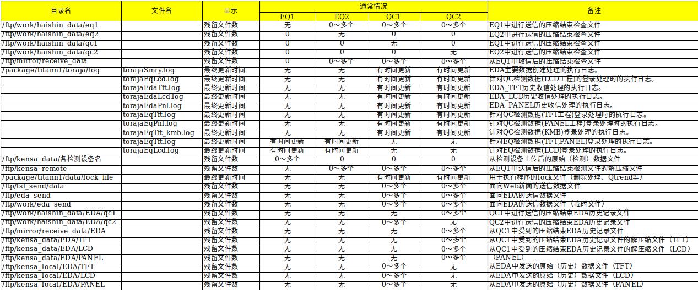
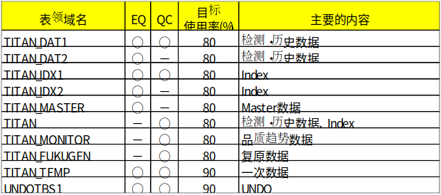

<style lang='stylus' scoped>

</style>

<a-col :md="8" :lg="2" class="menu">

</a-col>

<a-col :md="24" :lg="18" class="markdown-body">

# Titan - 点检手册

## 服务器一览
Titan 有 6 台生产服务器，1 台开发机: 

|别名|hostname|IP|
|---|---|---|
|EQ1|tn1s003|10.53.144.13|
|EQ2|tn1s004|10.53.144.14|
|EQ3|tn1s005|10.53.144.5|
|EQ4|tn1s006|10.53.144.6|
|QC1|tn1s001|10.53.144.17|
|QC2|tn1s002|10.53.144.18|
|DEV|tn1g001|10.53.144.180|

> 点检账号：`titanchk`，密码：`cimcheck`

## 插槽目视
如果下面出现异常的话，有可能硬件出现问题:

- `LED` 是否为无障碍状态？磁盘的话，请打开机箱前盖确认 `LED` 情况。
- 确认 `CPU` 的 `Attention ramp` 是否闪烁。

> 机房巡检人员点检此项

## 系统消息
登录 `Titanlient`（账号`1`，密码：`11`），查看系统消息，注意错误日志和警告日志。


## CPU负载
原则上不超过 `CPU` 的核心数，可作为参考：`EQ` 系列为 4 核、`QC` 系列 6 核。

1. 查看当前负载: 
```bash
(titanchk@tn1s002)101% uptime
 10:36am  up 186 days, 12:24,  5 users,  load average: 0.55, 0.50, 0.49
```

2. 查看过去一段时间内的负载（EQ3/EQ4 此脚本目前尚未启动）：

```bash
(titanchk@tn1s002)102% tail -100 /package/titann1/tool/eda_watch_shells/log/uptime.log
  2:20am  up 186 days,  4:08,  3 users,  load average: 0.65, 0.75, 0.71
  2:25am  up 186 days,  4:13,  3 users,  load average: 0.52, 0.61, 0.66
  2:30am  up 186 days,  4:18,  3 users,  load average: 0.49, 0.55, 0.62
  2:35am  up 186 days,  4:23,  3 users,  load average: 0.54, 0.54, 0.60
  2:40am  up 186 days,  4:28,  3 users,  load average: 0.55, 0.56, 0.59
  ......
```

## 磁盘使用

需要应对的情况：

- 磁盘或者 `inode` 的使用率突然增加（每日 `1%` 以上）
- 磁盘或者 `inode` 的使用率近于危险状态，参照：


```bash
# 举个例子
(titanchk@tn1s002)103% bdf -i | awk '{print $1 "    " $5 "    " $8}' | sort
Filesystem    %used    %iuse
/dev/vg00/lvol1    49%    2%
/dev/vg00/lvol10    1%    0%
/dev/vg00/lvol11    7%    0%
/dev/vg00/lvol3    39%    30%
/dev/vg00/lvol4    70%    45%
/dev/vg00/lvol5    74%    67%
/dev/vg00/lvol6    50%    3%
/dev/vg00/lvol7    47%    27%
/dev/vg00/lvol8    45%    31%
/dev/vg00/lvol9    7%    0%
/dev/vg01/lvol1    47%    0%
/dev/vg01/lvol4    34%    1%
```

其中：

- `-i`：表示查看 `inode` 信息
- `awk`：格式化打印，去掉后可以看到更详细信息
- `lvol8` 容易达到警告值

## 文件残留
用于显示调查TITAN目录，文件个数以及最终更新时间界面，参照：



```bash
(titanchk@tn1s002)105% dirwatch.sh
Hostname        Date                Load Average        Tyohyo
=============== =================== =================== ======
tn1s002         2019/04/29 10:40:02    0.64, 0.56, 0.51      0

Checking directory ...

Directory Name                           File Num File Name                                          Modify Date
======================================== ======== ================================================== ===============
/package/titann1/data/lock_file                 1                                                    Limit 600(s)
                                                  qtrend.lock                                         Apr   29 10:30
---------------------------------------- -------- -------------------------------------------------- ---------------
/ftp/tsl_send/data                              0
---------------------------------------- -------- -------------------------------------------------- ---------------
/ftp/eda_send                                   0
---------------------------------------- -------- -------------------------------------------------- ---------------
/ftp/work/eda_send                              0
---------------------------------------- -------- -------------------------------------------------- ---------------
/ftp/mirror/receive_data                        1
---------------------------------------- -------- -------------------------------------------------- ---------------
/ftp/work/haishin_data/EDA/qc1                  0
---------------------------------------- -------- -------------------------------------------------- ---------------
/ftp/mirror/receive_data/EDA                    0
---------------------------------------- -------- -------------------------------------------------- ---------------
/package/titann1/toraja/log                     9                                                    Limit 7200(s)
                                                  torajaSmry.log                                      Apr    6 00:50
                                                  torajaEqPnl.log                                     Apr   26 16:37
                                                  torajaEqTft_kmb.log                                 Feb   21 16:17
                                                  torajaEdaPnl.log                                    Apr   29 10:26
                                                  torajaEdaTft.log                                    Apr   29 10:26
                                                  torajaEqTft.log                                     Apr   29 10:39
                                                  torajaEdaLcd.log                                    Apr   29 10:31
                                                  torajaEqLcd.log                                     Apr   29 10:40
                                                  torajaEqTftSub.log                                  Apr   29 10:37
---------------------------------------- -------- -------------------------------------------------- ---------------
/ftp/kensa_data                                 0
---------------------------------------- -------- -------------------------------------------------- ---------------
/ftp/kensa_data/EDA/TFT                         0
---------------------------------------- -------- -------------------------------------------------- ---------------
/ftp/kensa_data/EDA/LCD                         1
---------------------------------------- -------- -------------------------------------------------- ---------------
/ftp/kensa_data/EDA/PANEL                       0
---------------------------------------- -------- -------------------------------------------------- ---------------
/ftp/kensa_local                                0
---------------------------------------- -------- -------------------------------------------------- ---------------
/ftp/kensa_local/EDA/TFT                        0
---------------------------------------- -------- -------------------------------------------------- ---------------
/ftp/kensa_local/EDA/LCD                        0
---------------------------------------- -------- -------------------------------------------------- ---------------
/ftp/kensa_local/EDA/PANEL                      0
---------------------------------------- -------- -------------------------------------------------- ---------------
/ftp/kensa_remote                               0
               /rep21                           1
               /rep21                           0 unlock.dat                                          Apr   29 10:38
---------------------------------------- -------- -------------------------------------------------- ---------------
/ftp/kensa_remote/EDA/TFT                       0
---------------------------------------- -------- -------------------------------------------------- ---------------
/ftp/kensa_remote/EDA/LCD                       0
---------------------------------------- -------- -------------------------------------------------- ---------------
/ftp/kensa_remote/EDA/PANEL                     0
---------------------------------------- -------- -------------------------------------------------- ---------------
/ftp/work/eda_send_req                          0
---------------------------------------- -------- -------------------------------------------------- ---------------
/ftp/work/qt_rcount                             0
---------------------------------------- -------- -------------------------------------------------- ---------------

                                                     Copyright (c) 2004 All Rights Reserved by YDC Corporation, LTD.

```

## lock文件

- 忽略 `qtrend`，此功能未使用 
- `lock` 文件是实时刷新的，如果当前存在，可以过一会再查看是否还有
- 如果某 `lock` 文件长时间滞留，可能就会接到电话说其对应的装置查询或者下载不到数据，联系担当处理。

```bash
(titanchk@tn1s002)106% ll /package/titann1/data/lock_file
total 0
-rw-r--r--   1 titann1    titan            0 Apr 29 10:40 m_extractuik04.lock
-rw-r--r--   1 titann1    titan            0 Apr 29 10:30 qtrend.lock
```

## 进程确认

- `Normal` 表示正常
- 异常情况：PID File (<进程名>.pid) is invalid. Process is not running.

```bash
(titanchk@tn1s002)107% procchk.sh
Hostname        Date                Load Average        Tyohyo
=============== =================== =================== ======
tn1s002         2019/04/29 10:41:22    0.72, 0.60, 0.53      0

Checking process ...

Process Name         Stime    Message
==================== ======== ================================================================================
eda_daemon            Feb 21  Normal.
eda_req_daemon        Feb 21  Normal.
eda_send              Feb 21  Normal.
m_extract_d           Feb 21  Normal.
e_compress_d          Feb 21  Normal.
e_distribution_d      Feb 21  Normal.
e_extract_d           Feb 21  Normal.
TorajaSurvey_eq_tft   Feb 21  Normal
```

## 表空间
参照：



```bash
(titanchk@tn1s002)108% tspace

SQL*Plus: Release 11.2.0.1.0 Production on Mon Apr 29 10:42:13 2019

Copyright (c) 1982, 2009, Oracle.  All rights reserved.


Connected to:
Oracle Database 11g Enterprise Edition Release 11.2.0.1.0 - 64bit Production


                      *****   TableSpace Usage Info  *****

TABLE_SPACE_NAME     CONT EXT ALL    TOTAL(MB)     USED(MB)     FREE(MB) %USAGE
-------------------- ---- --- --- ------------ ------------ ------------ ------
SYSAUX               PERM LOC SYS    7,210.000    6,668.688      541.313  92.49
SYSTEM               PERM LOC SYS    2,000.000      462.063    1,537.938  23.10
TEMP                 TEMP LOC UNI    1,200.000    1,196.000        4.000  99.67
TITAN                PERM LOC SYS  307,200.000  159,707.250  147,492.750  51.99
TITAN_DAT1           PERM LOC SYS  153,600.000   56,890.250   96,709.750  37.04
TITAN_FUKUGEN        PERM LOC SYS   10,240.000    2,250.125    7,989.875  21.97
TITAN_IDX1           PERM LOC SYS  102,400.000   31,403.438   70,996.563  30.67
TITAN_MONITOR        PERM LOC SYS  256,000.000    9,520.188  246,479.813   3.72
TITAN_TEMP           TEMP LOC UNI   30,720.000    7,003.000   23,717.000  22.80
UNDOTBS1             UNDO LOC SYS   49,320.000    9,704.000   39,616.000  19.68
USERS                PERM LOC SYS    1,510.000    1,288.313      221.688  85.32
Disconnected from Oracle Database 11g Enterprise Edition Release 11.2.0.1.0 - 64bit Production
(titanchk@tn1s002)109% 
```
## 系统日志

酌情选择过滤条数。

过滤掉ftp记录：
``` bash
tail -500000 /var/adm/syslog/syslog.log | grep -v 'ftpd'
```

查看集群信息：
```bash
tail -500000 /var/adm/syslog/syslog.log | sed -n '/cmcld/p'

tail -1000 syslog.log | grep 'cmcld'
```

## 簇和数据包
需要切换至 `root` 账户，密码还记得吗？

正常情况：

- `STATUS`: `up`
- `STATE`: `running`

```sh
(titanchk@tn1s002)109% su -
Password: 
tn1s002#[/]cmviewcl

CLUSTER           STATUS       
TitanN1_cluster   up           
  
  NODE           STATUS       STATE        
  tn1s002        up           running      
  tn1s001        up           running      

    PACKAGE        STATUS           STATE            AUTO_RUN    NODE        
    pkg_qc         up               running          enabled     tn1s001     
    pkg_office     up               running          enabled     tn1s001     
    pkg_gazou      up               running          enabled     tn1s001     
tn1s002#[/]
```

## 维护邮件
可作参考

```bash
tn1s002#[/var/mail]ll /var/mail
total 1264
-rw-rw----   1 root       mail        578210 Apr  6 11:00 root
-rw-rw----   1 titann1    mail         55203 Apr  6 11:00 titann1
```

</a-col>
<a-col :md="8" :lg="4">

[toc]

</transition>
</a-col>
