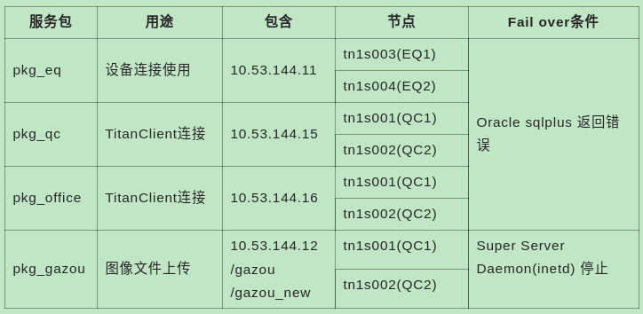
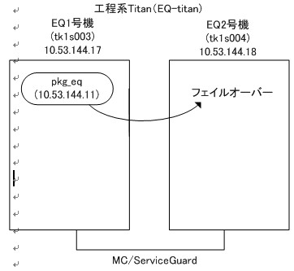
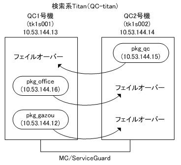
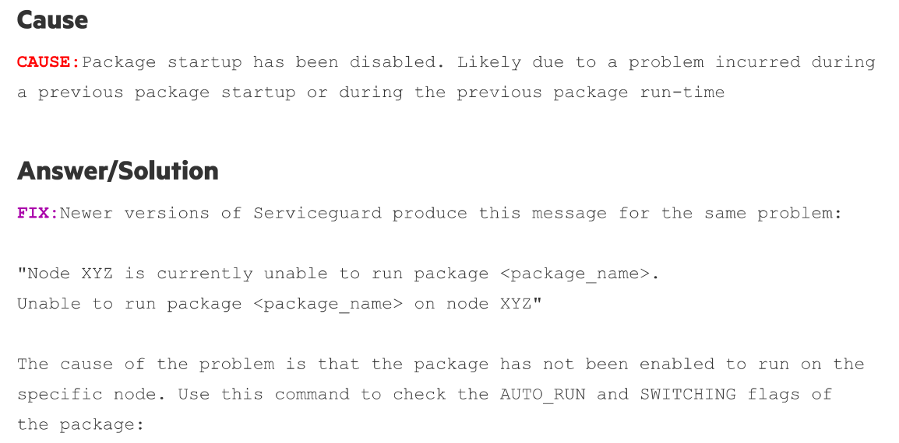

<style lang='stylus' scoped>
.warning
  color red
</style>

<a-col :md="8" :lg="2" class="menu">

</a-col>

<a-col :md="24" :lg="18" class="markdown-body">

# TITAN EQ/QC 集群

<!-- [toc]

<br><br><br><br><br><br><br><br><br><br><br><br> -->

## 简介

### 服务包一览



### EQ-Titan

 


> `EQ3` 和 `EQ4` 分别运行着 `Oracle`，实际上并不是集群状态。`EQ1` 连接 `EQ3`，`EQ2` 连接 `EQ4`。

### QC-Titan

 

## 常用操作

### 查询状态

```bash
tn1s003#[/]cmviewcl

CLUSTER              STATUS       
EQ_TitanN1_cluster   up           
  
  NODE           STATUS       STATE        
  tn1s003        up           running      

    PACKAGE        STATUS           STATE            AUTO_RUN    NODE        
    pkg_eq         up               running          enabled     tn1s003     
  
  NODE           STATUS       STATE        
  tn1s004        up           running
```

- 查询命令：`cmviewcl`，需在 `root` 用户下（哪个集群节点都可以）
- 注意示例中的 `up`、`running`、`enabled`，表示正常状态 
- 示例中表示 `pkg_eq` 运行在 `tn1s003`

### 启动 cluster

当 `cluster` 中的所有 `node` 都启动后，再执行此操作（需要数分钟时间）。在启动时，未激活的 `node` 会被剔除。

```bash
cmruncl -v
```

> 在当前 `TITAN` 系统中，基本上从来不需要运行此命令。`MC/SG` 随着开机关机而启动或停止。

### 停止 cluster

```bash
cmhaltcl -v -f
```

- `-f`：强制停止

> `/etc/rc.config.d/cmcluster` 设置了 `AUTOSTART_CMCLD` 为 `1`，所以关机时 `MC/SG` 会自动停止。若设置为 `0`，需要先停止再关机，否则再次启动时可能会因为 `LV` 状态而启动失败。

> 在当前 `TITAN` 系统中，也基本上从来不需要运行此命令。

### 添加节点

启动节点的 `cluster` 进程，加入 `cluster`：

```bash
cmrunnode -v hostname
```

### 切换 package

在发生已经定位到 `package` 的异常时，我们一般会通过切换 `package` 至另一个节点来恢复 `TITAN` 功能。

这是一种需要付出一定代价的措施，<span class="warning">不是紧急情况，尽量避免使用</span>。

<span class="warning">注意：</span>在一些极少的情况下，下面的命令并不一定每次都能完美的执行，在理解的情况下，根据错误提示随机应变。

下面的命令在需要操作的 `cluster` 中的哪个节点执行都可以，执行前先确认状态。

1. 停止某程序包：

    ```bash
    cmhaltpkg -v pkg_name
    ```

2. 将程序包运行在某节点

    ```bash
    cmrunpkg -v -n hostname pkg_name
    ```

    举例，某失败的情况：
    ```bash
    tn1s003#[/]cmrunpkg -v -n tn1s004 pkg_eq
    Unable to run package pkg_eq on node tn1s004. Node is not eligible.
    cmrunpkg: Unable to start some package or package instances
    tn1s003#[/]cmmodpkg -e -n tn1s004 pkg_eq
    cmmodpkg: Completed successfully on all packages specified
    ```

3. 将程序包状态改变为 `enabled`：

    ```bash
    cmmodpkg -e pkg_eq
    ```

4. 再次确认状态

    ```bash
    cmviewcl
    ```

---

## Cluster & Package

我们以 `EQ` 的 `pkg_eq` 为例，分析 `MC/SG` 启动 `package` 的过程，继而可以对 `failover` 有更进一步的了解。

### 启动

查看 `pkg_eq` 的控制脚本[`control_eq.sh`](/docs/static/control_eq.sh)：

1. 版本、磁盘检测等，由于 `HP-UX` 命令的关系，此脚本只向前兼容

2. 验证物理数据复制（在 `TITAN` 系统中未使用 `MetroCluster` 或 `ContinentalClusters `，所以这里什么也没有做）

3. 激活磁盘卷组

    这里需要注意，如果内置硬盘或`3par` 存储有故障，会出现激活失败的情况。然后 `deactive` 卷组，报错并退出。

    默认使用的激活命令如下：
    ```bash
    # 专有模式激活卷组
    # 未提供 vg_name，默认操作 `/etc/lvmtab` 和 `/etc/lvmtab_p`，如果指定 -c、-x、-Q、-R，则只对指定的某个卷组有效
    # -a e 表示使卷组 available
    # -a n 表示 deactive
    vgchange -a e
    ```

4. 检测并挂载文件系统
    
    将逻辑卷挂载为文件系统的目录。在 `EQ1`/`EQ2` 中，除了内置硬盘外，还需要挂载 `3par` 中的一块存储至 `/ftp`。如果挂载失败，脚本退出执行并报错。

    > `/etc/fstab`

5. 添加 `IP` 地址

    在 `EQ` 集群中指定的 `IP` 地址和子网是 `10.53.144.11` 和 `10.53.144.0`。

    ```bash
    # -a 添加 IP 至子网
    # -i 指定 IP
    cmmodnet -a -i 10.53.144.11 10.53.144.0

    # 添加完之后还会检测是否为心跳 IP 或 `netstat -in` 能否正则匹配到等
    ```

6. 网络文件系统锁文件迁移等

7. 执行用户自定义命令，需要自行编写 `shell` 函数并放进 `customer_defined_run_cmds`

8. 启动服务

    使用 `cmrunserv` 启动服务: 
    - `srv_eq`：`pkg_eq` 的主程序
    - `mon_pkg_eq`：监控进程

9. 启动资源

    启动延迟资源，在 `EQ` 集群中实际上没有延迟资源。

### 停止

停止是上述步骤的反向操作。

---

## Failover

### Failover 的条件

`Serviceguard` 的 `failover` 的原因可以分为两大类：`heartbeat` 传输问题和不满足 `package` 的 `up` 条件。

1. `haertbeat` 传输失败有可能因为以下原因：

    - 集群节点重启或断电
    - `heartbeat` 网络连接异常
    - `NODE_TIMEOUT` 设置
    - 网络端口被禁止

2. 不满足 `package` 的 `up` 条件：

    - 节点无法管理包服务
    - 包所依赖的网络子网已停止正常运行


另外，因为 `EQ Cluster` 中的 `Titan` 应用和其对应的 `Oracle` 数据库部署在不同的服务器，当数据库出现异常时，`Titan` 应用也就毫无意义，而 `Oracle` 数据库不在 `MC/SG` 控制中。所以，`pkg_eq` 中还包含一个前面提到的监控服务 [`mon_pkg_eq`](/docs/static/mon_pkg_eq.sh)：

从 `187` 行开始看：
```bash
# .....省略......
  while true ; do
    if [ "$PROC_CHECK" -ne 0 ]
    then
# .....省略......
      # ORACLE Login Check
      ${ORACLE_HOME}/bin/sqlplus -S ${db_user}/${db_pass} <<EOF
      whenever oserror exit 1 rollback
      whenever sqlerror exit 1 rollback
      exit
EOF
      if [ $? -ne 0 ] 
      then
        echo "ORACLE is not running"
        break;
      fi

    fi
    sleep 5
  done
# .....省略......
```

每隔 `5s` 检测 `Oracle` 登录，如果遇到 `sqlplus` 错误，则终止循环，`trap` 捕捉信号，退出脚本。连续尝试三次仍无效后，`MC/SG` 开始 `Failover`。

> `6/15` 和 `6/16` 发生 `failover` 的原因即是如此。 

### 6/15 失败调查

`6/15 4:52` 发生了 `failover`，`package` 停止后但是未能在另一的节点上正常启动，

HP IT 资源中心（`www.itrc.hp.com`）无法打开，看不到 `Serviceguard` 的发布记录。最终借助谷歌搜索到一篇文章，给出的回答如下图，猜测很有可能是 `package` 在 `failover` 之前或过程中被 `disable` 了，导致没有正常启动在另一节点上。

> `6/16` 和 `6/21` 也发生相同的问题，`failover` 均成功。其中 `6/21` 的 `failover` 完美进行， 无任何影响，只是在日志中才看出。 



</a-col>

<a-col :md="8" :lg="4">

[toc]

</a-col>
