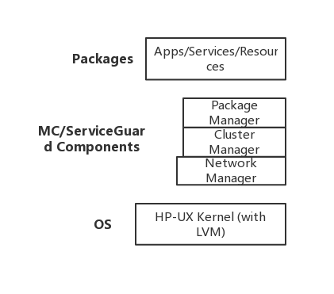

<style lang='stylus' scoped>

</style>

<a-col :md="8" :lg="2" class="menu">

</a-col>

<a-col :md="24" :lg="18" class="markdown-body">

# HP MC/ServiceGuard

## 简介

`HP MC/ServiceGuard` 利用网络把一些服务器连接起来，并且在系统中有足够的冗余硬件和软件来保证任何一个单独的错误并不显著的影响整个系统所提供的服务，从而建立一个高可用的集群服务器系统。

## 工作原理和组件

`MC/ServiceGuard` 的组件图和其所处的层次结构：



### Cluster Manager

`Cluster Manager` 是用来初始化集群系统、监控集群系统的“健康”情况，辨别节点产生的错误，管理和配置新节点加入到集群系统中和一个节点从集群系统中离开。

集群锁（`Cluster Lock`）所有节点共享的磁盘空间。当集群发生错误，`MC/ServiceGuard` 把原来的系统拆分为两个相等的子集群系统，此时集群锁被使用，获得锁的那个子集群系统形成一个新的集群系统，从而避免两个子系统同时运行。当两个子系统节点数目不一样的时候，数目大于 `50%` 的那个子系统会获得集群锁。如果使用的是两个节点的集群系统的话，必须配置集群锁；当两个节点之间的通讯中断的时候，集群锁所在的那个节点就会代替整个集群系统运行，另外一个节点就会停机。如果没有集群锁的话，任何一个节点出现错误停机都将造成另外一个节点停机使得整个集群系统停机。

> `heartbeat message`：每一个处在集群系统中的服务器通过一个监控 `LAN` 或者 `RS232` 的串口向集群控制点定时发送一个 `heartbeat message`，如果集群控制点在规定的时间内没有收到这个` heartbeat message` 的话，就会重新构架整个集群系统。

### Package Manager

集群系统中每一台机器上都运行一个程序包管理器（`Package Manager`）的实例，程序包管理器的作用是根据用户控制脚本指令运行、停止程序和服务，根据所监控的资源作出反映。在集群控制点服务器上运行的就叫程序包管理点（`Pachage Coordinator`），作用是确定在什么时间、什么地方运行、停止和删除程序包。

一旦一个集群系统被建立，在每个节点上的 `package manager` 就启动了该节点上的程序组，`package manager` 通过启动包控制脚本来启动一个程序包，这个脚本完成以下一些工作：
- 使用逻辑卷管理器命令激活该程序所需要的磁盘卷组
- 从活动卷组加载文件系统到本地节点
- 使用 `cmrunserv` 命令启动在包里面配置好的每一个程序，这个命令同时启动了对服务的监控。

`package manager` 也可以停止一个程序包的运行。

### Network Manager

`network manager` 的主要目的是监控和恢复网络设备的错误，保证用户服务的高可靠性。实际上就是对主网络接口为每个服务分配 `IP` 地址，同时监控网络设备的健康状况，在必要的时候转移服务的运行。

每个节点对于处于工作状态的的网络接口都应该分配一个 `IP` 地址，这个静态的 `IP` 在文件 `/etc/rc.conf.d/netconf` 中配置。一个静态的 `IP` 地址不可以转移到另外一个节点去，但是可以在需要的时候转移给备用的网络接口。静态的 `IP` 地址与程序包并不关联，它被用来在网络中传送 `heartbeat message`。

除了静态的 `IP` 地址，你可以给每一个程序包分配一个或者多个唯一的 `IP` 地址。这种 `IP` 地址叫住可重分配的 `IP` 地址（动态 `IP`），这种 `IP` 可以动态从一个节点转移到另外一个节点。静态和动态的 `IP` 地址在 `LAN` 出问题的时候都会被转移到备用 `LAN` 设备上去，如果程序包被转移到备用节点，动态的 `IP` 地址还可以被备用节点使用，从而使得程序仍然可以访问这些包而并不需要知道它在哪个节点上。如图：

> 当一个动态 `IP` 地址被转移到一个新的节点的时候，集群系统还需要做一件很重要的是就是向整个网络发送一个 `ARP` 广播，通知各个节点这个动态 `IP` 地址所对应的新的连接层的地址。每个点收到这个 `ARP` 广播后更新自己的 `ARP` 资料从而反应网络的变化。

## 安装和配置

`HP MC/ServiceGuard` 是收费软件，价格不菲，一般情况下是项目实施方进行安装操作。我们搞不到安装包，也没有序列号，在这里简单介绍下安装流程。

> **不要在服务器上进行下面任意一个命令！**

###  安装前准备

`MC/ServiceGuard` 使用 `ARPA` 服务来保证在集群系统内每个节点之间的通讯安全。在安装之前，必须指明集群系统中的每一台机器都可以被另外一台机器以 `root` 的身份访问。

除了使用操作系统本身的配置文件 `hosts` 来定义可访问主机外，还有另外一个文件 `/etc/cmcluster/cmclnodelist` 来定义，`MC/ServiceGuard` 将首先检查这个文件是否存在，存在就使用这个文件中定义的主机列表，否则就使用 `hosts`。

将这个配置文件拷贝到每一个主机。

使用 `NTP` 服务来保证每个节点的时间保证同步。

### 安装 `MC/SG`

假设已经安装了 `HP-UX`。在每个节点按下面的步骤安装 `MC/ServiceGuard`：
1. 加载 `MC/ServiceGuard` 分发的载体设备，磁带机或者光驱等
2. 进入安装目录，使用命令 `swinstall` 来，运行软件的安装
3. 选择正确的输入设备（使用光驱安装的话就选择 `CD-ROM` 了）
4. 在所显示的列表中选择包：`B3935BA   MC/ServiceGuard`
5. 选择了包后，选择 `OK`
6. 在每个节点上使用 `ioscan` 命令核实一下磁盘和驱动器是否被正确配置了

### 为根逻辑卷建立镜像

**假设**主盘为 `/dev/dsk/c4t5d0`，其镜像盘是 `/dev/dsk/c4t6d0`：

1. 建立将被用作镜像的可启动 `LVM` 盘：
    ```bash
    pvcreate –B /dev/rdsk/c4t6d0
    ```

2. 将这个盘添加到当前跟卷组中：
    ```bash
    vgextend /dev/vg00 /dev/dsk/c4t6d0
    ```

3. 把它设置为启动盘：
    ```bash
    mkboot /dev/rdsk/c4t6d0
    ```

4. 将正确的 `AUTO` 文件拷贝到新的 `LIF` 区域：
    ```bash
    mkboot –a “hpux –l q (;0) /vmunix” /dev/rdsk/c4t6d0
    ```

5. 将引导卷、主卷和主交换分区镜像到这个新的可引导磁盘上去，确定在 `vg00` 目录下的所有设备都被镜像（比如`/usr`，`/swap`等）：
    ```bash
    # 必须保证引导逻辑卷首先被镜像
    lvextend –m 1 /dev/vg00/lvol1 /dev/dsk/c4t6d0
    lvextend –m 1 /dev/vg00/lvol3 /dev/dsk/c4t6d0
    lvextend –m 1 /dev/vg00/lvol2 /dev/dsk/c4t6d0
    ```

6. 为镜相的卷更新在 `BDRA` 中的启动信息：
    ```bash
    /usr/sbin/lvlnboot –b /dev/vg00/lvol1 （启动）
    /usr/sbin/lvlnboot –v –r /dev/vg00/lvol3
    /usr/sbin/lvlnboot –s /dev/vg00/lvol2 （交换）
    ```

7. 检查 `BDRA` 是否正确：
    ```bash
    /usr/sbin/lvlnboot –R /dev/vg00
    ```

8. 检查镜像是否正确创建
    ```bash
    lvlboot –v
    ```

### 复制磁盘卷组

假设节点 `node1` 上已经配置好了磁盘分区、卷组等，现在我们要在节点 `node2` 上建立同样的卷组。

1. 将 `node1` 上的卷组映象文件复制到指定文件中：
    ```bash
    vgexport –p –s –m /tmp/vgdatabase..map  /dev/vgdatabase
    ```

2. 在 `node1` 节点上，将这个文件复制到 `node2` 节点：
    ```bash
    rcp /tmp/vgdatabase.map ftsys10: /tmp/vgdatabase.map
    ```

3. 在 `node2` 节点上，建立卷组目录：
    ```bash
    mkdir /dev/vgdatabase
    ```

4. 在 `node2` 节点上 `/etc/vgdatabase` 目录下建立一个叫 `group` 的控制文件：
    ```bash
    mknod /dev/vgdatabase/group c 64 0xhh0 0 0 0
    ```

5. 在 `node2` 节点上导入 `node1` 节点上的卷组数据：
    ```bash
    vgimport –s –m /tmp/vgdatabase.map /dev/vgdatabase
    ```

6. 检查 `/etc/lvmpvg` 文件中每个物理卷是否都是 `node2` 节点上的物理卷名字
7. 激活 `node2`上的卷组：
    ```bash
    vgchange –a y /dev/vgdatabase
    ```

8. 建立一个目录来加载磁盘：
    ```bash
    mkdir /mnt1
    ```

9. 加载并且校验卷组：
    ```bash
    mount /dev/vgdatabase/lvol1 /mnt1
    ```

### 配置集群系统

在节点 `node1` 上运行命令 `cmquerycl`：
```bash
cmquerycl –v –c /etc/cmcluster/cmclconf.ascii –n node1 –n node2
```

通常这是个很重要的命令，这个命令将定义生成由 `node1` 和 `node2` 两个节点组成的一个集群系统的配置文件。

查看集群系统磁盘错误的次数：
```bash
cmquerycl –v –n ftsys9 –n ftsys10
```

> 更多细节: `man cmquerycl`

### 校验分配置文件

`SAM` 可以自动帮助你校验集群系统的配置是否正确，但是如果你是直接编辑的配置文件的话，下面这个命令可能很有用：
```bash
cmcheckconf –v –c /etc/cmcluster/cmclconf.ascii
```

这个命令实际上是检查以下内容：
- 网络地址和网络连接是否有效；
- 集群锁是否正确设置并且可访问；
- 名字是否唯一，节点是否可以访问；
- 命令行的脚本是否存在和允许运行；
- 是否每个节点都被设置到同一个 `heartbeat` 的子网中；
- 是否只有一个 `CLUSTER_NAME`、`HEARTBEAT_INTERVAL`、`AUTO_START_ TIMEOUT` 被设置；
- `HEARTBEAT_INTERVAL` 的值最小是 `1` 秒（配置文件中的单位是毫秒）；
- `NODE_TIMEOUT` 的值至少是 `HEARTBEAT_INTERVAL` 值的两倍；
- `AUTO_START_ TIMEOUT` 合法值应该大于 `0`；

等等其他，在此只介绍以上比较容易出问题的地方。在这个集群系统配置文件被校验正确后，要让 `MC/ServiceGuard` 正确运行，在每个节点上都应有同样的这个配置文件：
```bash
# 首先获得集群锁并且初始化：
vgchange –a y /dev/vglock
# 然后分配出去：
cmapplyconf –v –C /etc/cmcluster/cmclconf.ascii –P /etc/cmcluster/ pkg1/pkg1conf.ascii
# 最后释放集群锁：
vgchang –a n /dev/vglock
```

### 测试运行状况：
- `cmrunnode`：启动一个节点
- `cmhaltnode`：停止一个节点（相当于 `shutdown` ）
- `cmruncl`：启动一个停止的集群系统
- `cmhaltcl`：停止一个运行的集群系统
- `cmdeleteconf`：删除集群配置文件（非常危险的命令，除非确实需要）

### 建立程序包

使用 `cmmakepkg` 来建立一个程序包配置文件（建议使用模板文件修改）。这里解释配置文件里面的几项内容的意义：
- `NODE_NAME`：把每一个节点的名字都输入，一个节点一行
- `RUN_SCRIPT` 和 `HALT_SCRIPT`：启动、停止程序包时运行脚本的路径
- `RESOURCE_POLLING_INTERVAL`：检查资源是否健全的时间间隔

程序包配置文件的检查和分配跟集群系统配置文件的过程相似。

### 重新配置
在一些情况下你需要重新配置你的集群系统，但是有几点必须注意：
- 在系统运行状态你不能改变集群锁的磁盘配置；
- 不能直接把一个正在运行程序的节点从集群系统中拿走，必须先停止它的运行；
- 不能直接把一个正在使用的磁盘卷组从配置文件中去掉，必须先停止使用该资源的程序包，然后才可以去除；
- 不能改变集群系统的时间参数；


## 命令详解

### 启动
```bash
cmruncl [-f] [-v] [-n NN...]
```
- `-f`    Force cluster startup without warning message
- `-v`   Verbose output
- `-n`  specific name(s) of node(s) to

### 停止

```bash
cmhaltcl
```

配置 `MC/ServiceGuard` 之后，数据库和应用进程的停止都可用MC的命令来执行。

`/etc/rc.config.d/cmcluster` 文件内的 `AUTOSTART_CMCLD`参数：
- `0`（缺省）：在 `shutdown` 主机之前注意一定要先停下MC的进程，否则下一次启动 `MC` 将因逻辑卷状态不对而不能正常执行
- `1`：`shutdown` 主机后，`MC` 的进程自动停下

### 运行状态
```bash
cmviewcl
```

### 启动指定节点的 MC
```bash
cmrunnode
```
本命令是启动指定主机的MC进程，但是它不会启动 `package`。

### 停止指定节点的 MC

```bash
cmhaltnode
```
停止指定主机的 `MC` 的后台进程，其结果是导致应用程序的切换。本命令可用以不停应用的系统升级、应用调整或参数调整。

### 停止应用包

本命令可以停止指定的应用包（即 `pkg`），但是它不会导致应用包的切换。如在已有两个应用包的 `CLUSTER` 群集中停止 `pkg1` 的运行，则在 `pkg1` 的运行机上执行以下命令：
```bash
cmhaltpkg -v pkg1
```

### 启动应用包
可以启动指定的应用包，如在 `CLUSTER` 群集中启动 `pkg2` ，则在希望 `pkg2` 运行的主机上执行以下命令：
```bash
cmrunpkg -v pkg2
```

### 改变应用包的切换属性

将 `pkg1` 的切换属性改成 `enable`：
```bash
cmmodpkg -e pkg1
```

</a-col>
<a-col :md="8" :lg="4">

[toc]

</transition>
</a-col>
